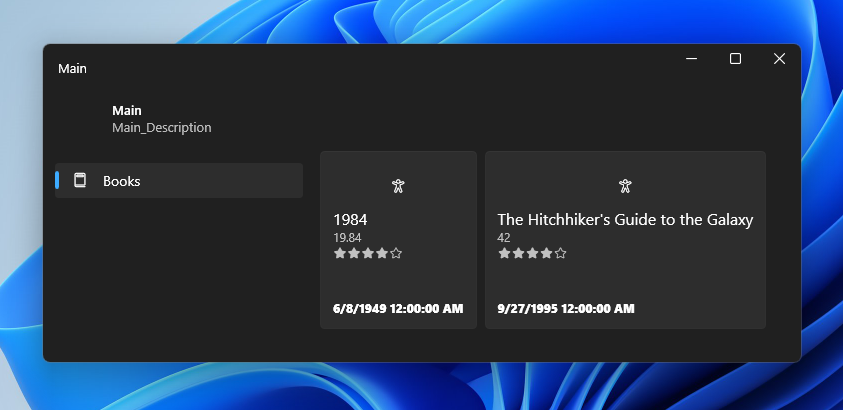

# abp-wpf

An abp.io BookStore sample including a more complete wpf example using mvvm source generators and a slick UI :heart_eyes:

## :tophat: Features

- [Abp](https://abp.io)
- [WPF UI](https://github.com/lepoco/wpfui)
- [Refractored.MvvmHelpers](https://www.nuget.org/packages/Refractored.MvvmHelpers/)
- [CommunityToolkit.Mvvm](https://www.nuget.org/packages/CommunityToolkit.Mvvm)

## :computer: Screenshot


## Interesting Bits

### Source Generators

This app utilizes the `CommunityToolkit.Mvvm` source generators [details](https://docs.microsoft.com/en-us/windows/communitytoolkit/mvvm/introduction). 

This makes it so we can cut loads of boilerplate out like this:

In `BookIndexViewModel.cs` 
```c#
[ICommand]
public async Task InitialAsync()
{
    await LoadDataAsync();
}
```

In `BookIndex.xaml`

```xml
<Behaviors:InvokeCommandAction Command="{Binding InitialCommand}"/>
```

The source generators take care of generating the command property and setting it up (what you would normally do in the constructor).

You can even handle the CanExecute simply:

```c#
public bool GetIsNotBusy() => IsNotBusy;

[ICommand(CanExecute = "GetIsNotBusy", AllowConcurrentExecutions = true)]
public async Task InitialAsync()
{
    await LoadDataAsync();
}
```

Note: As of right now, the CanExecute of the source generator can't seem to see the base property of `IsNotBusy` so  this is a simple workaround.

### Abp Localization in the XAML

`AppViewModel` exposes the Abp l18n via `L` so you can use it in the xaml like this:

```xml
<wpfui:NavigationItem
    Content="{Binding Path=L[Books]}" />
```

Where `Books` is the l18n key:

```json
{
  "culture": "en",
  "texts": {
    "Menu:Home": "Home",
    "Welcome": "Welcome",
    "LongWelcomeMessage": "Welcome to the application. This is a startup project based on the ABP framework. For more information, visit abp.io.",
    "Books": "BoOkS"
  }
}
```

### WPF Test Project

Check out the project `Acme.BookStore.Wpf.Tests` which is an adaptation of the Web tests specifically for testing the view models.

## BookStore Sample

- [Documentation](https://docs.abp.io/en/abp/latest/Tutorials/Part-1?UI=MVC&DB=EF)
- [Tutorial Source](https://github.com/abpframework/abp-samples/tree/master/BookStore-Mvc-EfCore)
