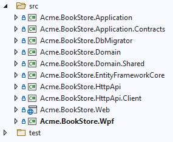
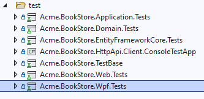

# How to integrate WPF template with an ABP solution

## Introduction

ABP comes with a [WPF template now](https://docs.abp.io/en/abp/latest/Startup-Templates/WPF), but it's a minimal example and doesn't include implementation within a solution nor testing. That's what we'll be discussing in this article.

## Creating the solution

> If you already have a project, you can skip this section.

To begin, start by creating a solution using `abp new Acme.BookStore`. This will create the initial setup, including the tiered layers and the base testing projects we'll need later.

Next, we'll want to create a new solution (somewhere else) using the WPF template by running `abp new Acme.BookStore.Wpf -t wpf`. When that's complete, move the `Acme.BookStore.Wpf` into your full solution. It should look like this:

<center>
  
</center>

### Setting up the Wpf project

First, you need to add project references to the `*.Application` and `*.EntityFrameworkCore` projects. That'll allow this app to interact with the system.

Second, modify the `*Module.cs` class and add the Application and EntityFrameworkCore modules as dependencies for this module, like so:

```c#
[DependsOn(typeof(AbpAutofacModule),
    typeof(BookStoreApplicationModule),                          // <<- add
    typeof(BookStoreEntityFrameworkCoreModule))]                 // <<- add
public class BookStoreWpfModule : AbpModule
{
    public override void ConfigureServices(ServiceConfigurationContext context)
    {
        Configure<AbpAuditingOptions>(options => options.IsEnabled = false);
        Configure<AbpBackgroundJobOptions>(options => options.IsJobExecutionEnabled = BackgroundJobConsts.IsEnabled);
        Configure<AbpBackgroundWorkerOptions>(options => options.IsEnabled = BackgroundJobConsts.IsEnabled);
    }
}
```

## Creating the test project

Go ahead and open the test solution folder and create a new project. It should basically be a copy of the `*.Web.Tests` project but change `Web` to `Wpf`

<center>
  
</center>

The test project should reference the following packages:

- [Microsoft.NET.Test.Sdk](https://www.nuget.org/packages/Microsoft.NET.Test.Sdk)
- [Abp.TestBase](https://www.nuget.org/packages/Abp.TestBase/)
- [Volo.Abp.TestBase](https://www.nuget.org/packages?q=Volo.Abp.TestBase)
- [Shouldly](https://www.nuget.org/packages/Shouldly/)
- [xunit.runner.visualstudio](https://www.nuget.org/packages/xunit.runner.visualstudio/)
- [Xunit.StaFact](https://www.nuget.org/packages/Xunit.StaFact/)

The test project should reference the following solution projects:

- The `*.Application.Tests` project
- The `*.Wpf` app project

Next, we'll need to create the module and wpf test base classes.

### Module Class

```c#
namespace Acme.BookStore;

[DependsOn(
    typeof(BookStoreWpfModule),
    typeof(BookStoreApplicationTestModule)
)]
public class BookStoreWpfTestModule : AbpModule
{
    public override void PreConfigureServices(ServiceConfigurationContext context)
    {

    }

    public override void ConfigureServices(ServiceConfigurationContext context)
    {
        ConfigureLocalizationServices(context.Services);
    }

    private static void ConfigureLocalizationServices(IServiceCollection services)
    {
        var cultures = new List<CultureInfo> { new CultureInfo("en"), new CultureInfo("tr") };
        services.Configure<RequestLocalizationOptions>(options =>
        {
            options.DefaultRequestCulture = new RequestCulture("en");
            options.SupportedCultures = cultures;
            options.SupportedUICultures = cultures;
        });

        services.Configure<AbpLocalizationOptions>(options =>
        {
            options.Resources
                .Get<BookStoreResource>()
                .AddBaseTypes(
                    typeof(AbpValidationResource),
                    typeof(AbpUiResource)
                );
        });
    }
}
```

The test base class that all tests will inherit.

```c#
public abstract class BookStoreWpfTestBase : BookStoreTestBase<BookStoreWpfTestModule>
{
    /// <summary>
    /// Shortcut for adding an NSubstitute.For a type and including the reference as a singleton
    /// </summary>
    /// <typeparam name="T">The interface to substitute</typeparam>
    /// <param name="backingStore">The local backing variable</param>
    /// <param name="services">The service collection to add the singleton to</param>
    public static void AddTestSubstitution<T>(ref T backingStore, IServiceCollection services)
        where T : class
    {
        backingStore = Substitute.For<T>();
        services.AddSingleton(backingStore);
    }
}
```

That should be all you need to start creating tests, however there are a few caveats.

1. Testing WPF requires special threading to be used, which is where the `Xunit.StaFact` package comes in ([details](https://github.com/AArnott/Xunit.StaFact)) but mainly the only difference when writing tests is that you use `[UIFact]` instead of `[Fact]` and the package will handle running the tests on an STA thread with the context synchronized. 
2. You're going to want to abstract the Dispatcher pretty quickly. In a WPF app, the dispatcher will be `Application.Current.Dispatcher` however you don't get access to that when running tests so do the following:

### Dispatcher Abstraction

In the WPF app, implement the types you see I've done [here](https://github.com/kfrancis/abp-wpf/tree/main/src/Acme.BookStore.Wpf/Core/Threading) including the `WpfDispatcher` which you'll use within the app to abstract to `Application.Current.Dispatcher`

Then, in your view models you can just inject `IDispatcher dispatcher` to run anything on the dispatcher.

In the test project, you can just implement a `SimpleDispatcher` which runs the code directly:

```c#
/// <summary>
/// A basic <see cref="IDispatcher"/> which simply runs the given code.
/// </summary>
public class SimpleDispatcher : IDispatcher, ISingletonDependency
{
    /// <inheritdoc/>
    public DispatcherType DispatcherType { get; }

    /// <summary>
    /// Creates a new <see cref="SimpleDispatcher"/> with the specified flags.
    /// </summary>
    /// <param name="dispatcherType">A set of <see cref="DispatcherType"/> flags indicating whether this <see cref="IDispatcher"/> manages special kinds of threads, which can (and should) be utilized in scenarios such as updating UI elements from code.</param>
    public SimpleDispatcher(DispatcherType dispatcherType = DispatcherType.Main)
    {
        DispatcherType = dispatcherType;
    }

    /// <inheritdoc/>
    public async Task RunAsync(Action execute)
    {
        execute();
    }

    /// <inheritdoc/>
    public async Task<T> RunAsync<T>(Func<T> execute)
    {
        return execute();
    }

    /// <inheritdoc/>
    public async Task RunAsync(Func<Task> execute)
    {
        await execute();
    }

    /// <inheritdoc/>
    public async Task<T> RunAsync<T>(Func<Task<T>> execute)
    {
        return await execute();
    }

    public void Run(Action execute)
    {
        execute();
    }
}
```

You can then create tests that look like the following:

```c#
public class MainWindow_Tests : BookStoreWpfTestBase
{
    private readonly ILoggerFactory _loggerFactory;
    private readonly IStringLocalizer<BookStoreResource> _localizer;
    private ISnackbarService _snackbarService;
    private ICurrentTenant _fakeCurrentTenant;
    private readonly IDispatcher _dispatcher;
    private MainWindowViewModel _viewModel;

    public MainWindow_Tests()
    {
        _loggerFactory = GetRequiredService<ILoggerFactory>();
        _localizer = GetRequiredService<IStringLocalizer<BookStoreResource>>();
        _snackbarService = GetRequiredService<ISnackbarService>();
        _fakeCurrentTenant = GetRequiredService<ICurrentTenant>();
        _dispatcher = GetRequiredService<IDispatcher>();
        _viewModel = new();
    }

    protected override void AfterAddApplication(IServiceCollection services)
    {
        AddTestSubstitution(ref _fakeCurrentTenant, services);
        AddTestSubstitution(ref _snackbarService, services);
    }

    private void GivenEmptyViewModel()
    {
        _viewModel = new MainWindowViewModel(_dispatcher, _loggerFactory, _localizer, _snackbarService);
    }

    [UIFact]
    public void CanInstantiate()
    {
        GivenEmptyViewModel();

        _viewModel.ShouldSatisfyAllConditions(
            vm => vm.ShouldNotBeNull(),
            vm => vm.IsBusy.ShouldBeFalse(),
            vm => vm.IsNotBusy.ShouldBeTrue()
        );
    }
}
```

## MVVM Setup

I've approached this article and the accompanying sample with MVVM in mind, so in that regard I prefer to utilize the [Refactored.MvvmHelpers](https://github.com/jamesmontemagno/mvvm-helpers) as a sort of super light boilerplate reduction, in particular the `BaseViewModel` though to make it work a little easier here I'm going to be inheriting it and adding some of the AspNetZero mobile bits:

```c#
public abstract class AppViewModel : BaseViewModel, ITransientDependency
{
    private readonly ILogger<AppViewModel> _logger;
    private readonly IStringLocalizer<BookStoreResource> _localizer;

    public IStringLocalizer<BookStoreResource> L => _localizer;

    public List<IDispatcher> Dispatchers { get; }

    protected AppViewModel(ILogger<AppViewModel> logger, IStringLocalizer<BookStoreResource> localizer, IDispatcher dispatcher)
        : this()
    {
        _logger = logger;
        _localizer = localizer;

        Dispatchers = new List<IDispatcher> { dispatcher };
    }

    protected AppViewModel()
    {

    }

    public virtual async Task InitializeAsync(object navigationData)
    {
        await Task.FromResult(false);
    }

    public object GetPropertyValue(string propertyName)
    {
        return GetType().GetProperty(propertyName).GetValue(this, null);
    }

    public T GetPropertyValue<T>(string propertyName)
    {
        return (T)Convert.ChangeType(GetPropertyValue(propertyName), typeof(T));
    }

    public bool LogException(Exception ex, bool shouldCatch = false, bool shouldDisplay = false)
    {
        if (ex == null) return shouldCatch;

        _logger?.LogException(ex.Demystify());
        if (shouldDisplay)
        {
            //Dispatcher.CurrentDispatcher.Invoke(() =>
            //{
            //    _ = Task.Run(() => _dialogCoordinator.ShowMessageAsync(this, _localizer?["Error"] ?? "Error", (_localizer?["Failed"] ?? "Failed") + $": {ex.ToStringDemystified()}"));
            //});
        }

        return shouldCatch;
    }

    public async Task SetBusyAsync(Func<Task> func, string loadingMessage = null, bool showException = true)
    {
        IsBusy = true;
        try
        {
            await func();
        }
        catch (Exception ex) when (LogException(ex, true, showException))
        {
        }
        finally
        {
            IsBusy = false;
        }
    }
}
```

An example of a view model for a dialog might be something like this then:

```c#
public partial class BookDetailViewModel : AppViewModel
{
    private readonly Func<Task> _closeAction;

    public BookDetailViewModel()
        : base()
    {
        Title = nameof(BookDetailViewModel);
    }

    public BookDetailViewModel(ILogger<AppViewModel> logger,
                               IStringLocalizer<BookStoreResource> localizer,
                               IDispatcher dispatcher,
                               Func<Task> closeAction = null)
        : base(logger, localizer, dispatcher)
    {
        _closeAction = closeAction;
    }

    [ICommand]
    public async Task CloseAsync()
    {
        if (_closeAction != null)
        {
            await _closeAction();
        }
    }
}
```

I'm also using the [CommunityToolkit.Mvvm](https://www.nuget.org/packages/CommunityToolkit.Mvvm) to further reduce the need to write all the command code.

## Code

The code for this article and project is available here: https://github.com/kfrancis/abp-wpf where you can see the app looks like this:


